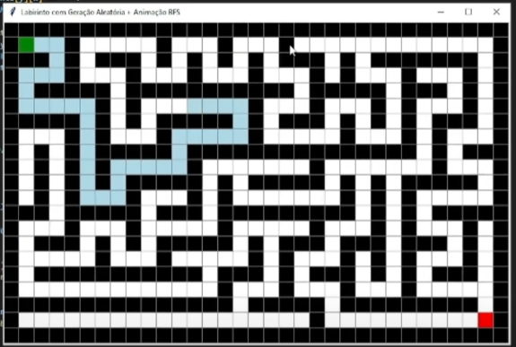
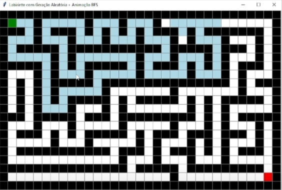
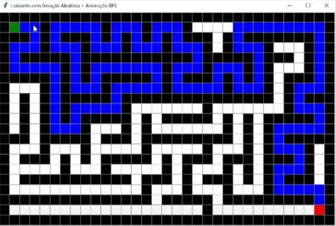

# Grafos1_Labirinto

**Número da Lista**: 1 
**Conteúdo da Disciplina**: Grafos 1 

## Alunos
|Matrícula | Aluno |
| -- | -- |
| 221022506  |  Cayo Felipe Alencar Camara |
| 190028963  |  Guilherme Brito de Souza |

## Sobre 
Este projeto tem como objetivo demonstrar o funcionamento do algoritmo de Busca em Largura (BFS) aplicado à resolução de labirintos, encontrando o menor caminho possível entre um ponto de início e um ponto de destino. O labirinto é gerado aleatoriamente utilizando um algoritmo baseado em busca em profundidade (DFS), garantindo que sempre haverá um caminho entre os dois pontos. Após a geração do labirinto, o algoritmo de BFS é executado a partir da célula inicial, explorando os caminhos possíveis até encontrar a célula final. Durante essa busca, os nós visitados são visualizados na tela por meio de uma animação, e ao encontrar o destino, o caminho correto é destacado, evidenciando a solução encontrada. 

## Screenshots

 
*Figura 1: Primeira imagem do grafo percorrendo o caminho* 

 
*Figura 2: Primeira ramificação do grafo realizando a busca em largura* 

 
*Figura 3: Menor caminho encontrado* 

## Instalação 
**Linguagem**: Python 
**Framework**: (caso exista) 
Descreva os pré-requisitos para rodar o seu projeto e os comandos necessários.

## Uso 
Nosso projeto pode ser rodado utilizando o Visual Studio Code, ao rodar o arquivo teste.py.

## Outros 
Link da apresentação no youtube: https://youtu.be/o7Kd-5Q7BWo